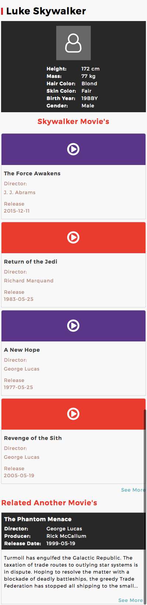
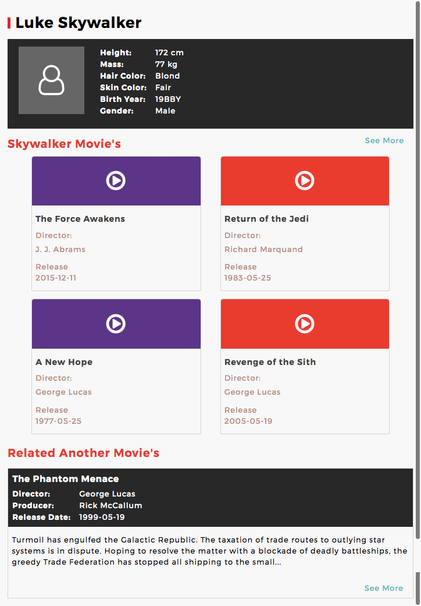
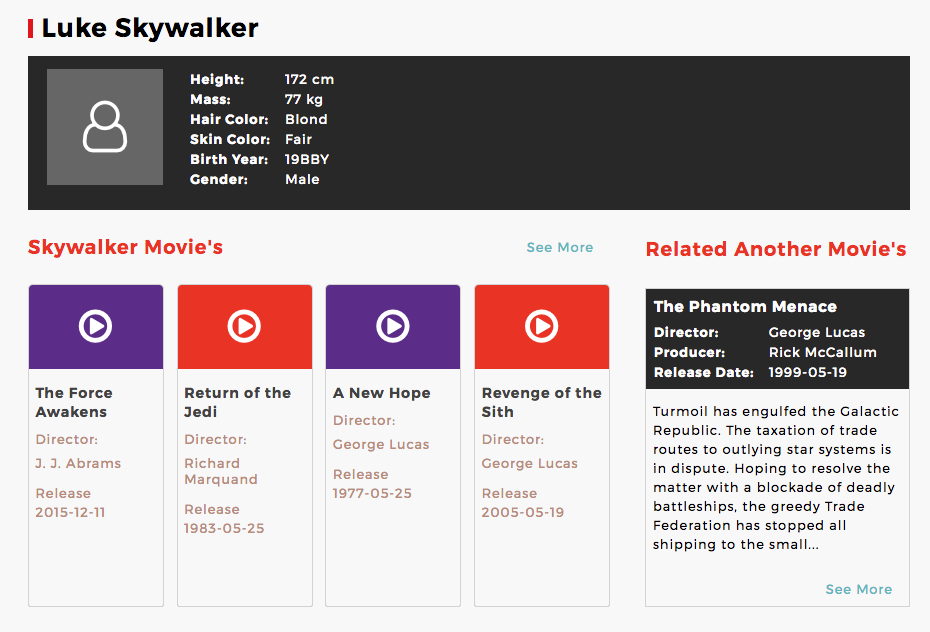

# Luke Skywalker Web

## Introduction

In this project, a mock up was given to me (you can see it in `initial assets` folder) and I have to replicate it using HTML, CSS, and javaScript using the data that is given through [The Star Wars API](https://swapi.co/).

## Usage

1. Download / Clone this repo.

2. Go inside this repo's root folder.

3. Go to terminal and invoke: `npm install`, `bower install` to install the project and all dependencies locally.

4. Type `gulp serve` on terminal and open `localhost:3000` in the browser.

### The Source

The source of this app can be seen in the src folder of master branch. 

## Developer's note

1. I hereby declare that this project is written by me (Wahidyan Kresna Fridayoka) and is a result of my own work.

2. I need more time to tinkering with javaScript `promise` to chain the fetching/AJAX dependency. Thus, I am kind of "cheating" by manually synchronize the chaining using javaScript's `setTimeout()` function.

3. Because of (2), you will need internet that is fast 3g or higher in order for this app to run correctly (I simulated it with fast 3g throttling connection simulation on Google Chrome's Dev Tools).

## Sreenshots

Display - Small Screen

Display - Medium Screen

Display - Large Screen

## License

[MIT](https://en.wikipedia.org/wiki/MIT_License).